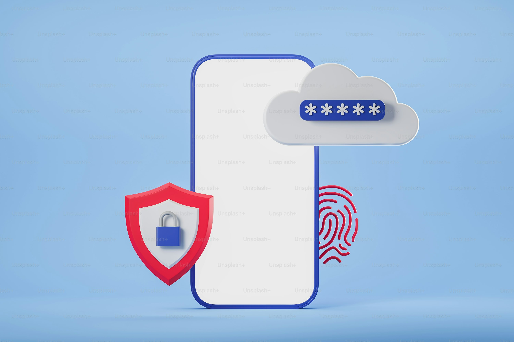

# Student Learning Portal

A Django-based Student Learning Portal that allows students and teachers to manage courses, study materials, notes, and learning resources through a user-friendly web interface.

## Features

* Student Registration & Login
* Teacher Login
* Course Management
* Study Material Upload & Access
* Notes Management
* Semester-wise Course Organization
* Responsive Bootstrap-Based Interface
* Secure Authentication System

## Technologies Used

* Python
* Django
* SQLite
* HTML5
* CSS3
* Bootstrap

## Project Screenshots

### Login Page



### Registration Page


### Home Page


### Courses Page


### Course Details Page


## Installation

### Clone the Repository

```bash
git clone https://github.com/OmKangralkar786/Student_Portal.git
cd Student_Portal
```

### Install Dependencies

```bash
pip install -r requirements.txt
```

### Apply Migrations

```bash
python manage.py migrate
```

### Run the Server

```bash
python manage.py runserver
```

Open your browser and visit:

```text
http://127.0.0.1:8000/
```

## Project Structure

```text
Student_Portal/
│
├── learning_portal/
├── student_portal/
├── static/
│   └── portal/
│       └── images/
│
├── media/
├── manage.py
├── requirements.txt
└── README.md
```

## Author

**Om Kangralkar**

GitHub: https://github.com/OmKangralkar786
